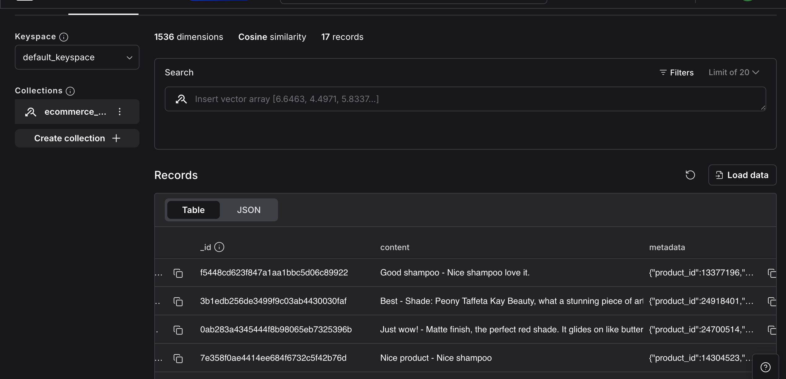

# ShopMate AI – Ecommerce Shopping Assistant

## Project Description

I am building a full-fledged chatbot system for an ecommerce website.

This chatbot is designed specifically for the ShopMate AI website and acts as a virtual shopping assistant for users. It is integrated directly into the website UI, allowing users to interact with it in real time.

The system includes:

* A frontend chat interface where users can type their queries
* A backend system that processes user input
* An API that connects the frontend and backend
* Chatbot logic that generates responses

The chatbot helps users with tasks such as searching for products, checking prices, exploring offers, and answering product-related queries on the website.

## What We Are Building

This project focuses on building an **Ecommerce Chatbot (Product Assistant)** where customers can ask questions and receive instant responses.

This chatbot acts as a virtual assistant for the website, helping users interact with the platform in a simple and conversational way.

## What Problem It Solves

* Helps users quickly find products without manually browsing
* Provides instant answers instead of waiting for customer support
* Improves user experience by guiding customers through the website
* Assists in decision-making (price comparison, reviews, offers)

## What Kind of Products It Supports

The chatbot can work for any ecommerce category, such as:

* Electronics (phones, laptops, accessories)
* Fashion (clothing, shoes)
* Groceries
* Home & kitchen products
* Beauty & personal care

It can be customized for any specific website or product catalog.

## Types of Queries It Can Answer

The chatbot can handle different types of user queries, including:

### Product Search

* "Show me laptops under ₹50,000"
* "Find running shoes for men"

### Price & Offers

* "What is the price of iPhone 13?"
* "Are there any discounts available?"

### Reviews & Recommendations

* "Is this product good?"
* "Which is the best phone under ₹30,000?"

### Order & General Queries (extendable)

* "Where is my order?"
* "What are the delivery charges?"

### General Assistance

* "Help me choose a product"
* "Suggest something for daily use"

## Tech Stack
(TODO)

## How It Works

1. User enters a query in the chatbot UI
2. The message is sent to the backend via an API endpoint
3. The backend processes the query using chatbot logic
4. A response is generated
5. The response is displayed back in the UI


## Why to Use Web Scraping

We use web scraping to fetch product data from ecommerce platforms so that the chatbot can use real product information to answer user queries.

This data is then stored and used by the chatbot to provide accurate and meaningful responses to user queries.

### Purpose

* To make the chatbot **data-driven** instead of rule-based
* To provide **real product information** rather than generic answers
* To enable **better recommendations and decision-making**

## SET-UP GUIDE

### Required Tools & Packages

Check if `uv` is installed:

```bash
uv --version
```

If not installed, run:

```bash
pip install uv
```

### Project Initialization

Create a new project:

```bash
uv init ecommerce-shopping-assistant
cd ecommerce-shopping-assistant
```

### Create Virtual Environment

Create a virtual environment with Python 3.10:

```bash
uv venv ecomassistant --python 3.10
```

Activate the environment:

```bash
source ecomassistant/bin/activate
```

### Clone GitHub Repository

Create a repository on GitHub, then link local project to Github repo :

```bash
git init
git remote add origin https://github.com/MeghaUkkali9/Ecommerce-Shopping-Assistant.git
```

To install packages under this project run:
```bash
uv pip install -r requirements.txt
```


To run scapper, streamlit is required
```bash
streamlit run scrapper_ui.py
```

add fastapi:
```
uv add fastapi
or 
uv add -r requirememts.txt
```

TO check Python versions available on machine: 
```bash
uv python list
```

------------------
## Setup AstraDB (Vector Database)

This project uses **AstraDB (DataStax / IBM)** as the vector database.

### 1. Create an AstraDB Account

Go to:
https://astra.datastax.com

---

### 2. Create a Database

Use the following link:
https://astra.datastax.com/org/75a5d1a0-3d92-4504-93ae-a95a76255745/create-database

---

### 3. Configure Database

While creating the database, use these settings:

* **Database Type**: Serverless (Vector Database)
* **Database Name**: `ecommerce_shopping_assistant`
* **Cloud Provider**: AWS
* **Region**: `us-east-2`

---

### 4. Get Credentials

After the database is created:

1. Go to **Database Dashboard**
2. Click on **Connect**
3. Select **Python / API Access**
4. Copy the following:

* `ASTRA_DB_API_ENDPOINT`
* `ASTRA_DB_APPLICATION_TOKEN`
* `ASTRA_DB_KEYSPACE`

---

### 5. Add to `.env`

Create a `.env` file in your project root and add:

```
ASTRA_DB_API_ENDPOINT=your_endpoint_here
ASTRA_DB_APPLICATION_TOKEN=your_token_here
ASTRA_DB_KEYSPACE=your_keyspace_here

OPENAI_API_KEY=your_openai_key
GROQ_API_KEY=your_groq_key
```

---

### 6. Verify Setup

Run the application to scrape and store data in db:
```
streamlit run scrapper_ui.py
```
to run fastapi:
```
uvicorn shopping_assistant.router.main:app --reload --port 8000
```

Inserted documents to Astra DB: 
        
        While building this pipeline, I decided not to store embeddings at the product level.Instead, I take each individual review of a product, clean it (remove emojis, fix formatting, etc.), and convert it into an embedding. Each of these embeddings is then stored as a separate record in Astra DB. So for one product with multiple reviews, I don’t create a single vector — I create multiple vectors (one per review). The reason for this is that reviews often contain different opinions. For example, one review might talk about long-lasting performance, another about color, and another about texture. If I combine all of them into one embedding, the meaning gets mixed and retrieval becomes less accurate. By storing one embedding per review, I preserve the exact context of each opinion. This allows me to perform fine-grained semantic search. 
        For example, if a user searches for “long-lasting lipstick under ₹1000”, the system can directly match reviews that specifically mention long-lasting performance, instead of matching an entire product description.
        This design significantly improves the quality of search and makes the system more useful for real-world recommendation use cases.


Issues faced:
GraphRecursionError: Recursion limit of 25 reached: Retriever → Grader → Rewrite → Assistant → Retriever → ...


###DOCKER:
1. Verify Docker Installation
```docker --version```

2. Manage Docker Images

List all images:
```docker images```

Remove an image:
```docker rmi <image_id>```
3. Build Docker Image
```docker build -t shopping-assistant .```
4. Manage Containers
List all containers (including stopped ones):
```docker ps -a```
5. Run the Application in a Container

Run the container:

```docker run -d -p 8000:8000 --name shopping-assistant shopping-assistant```

6. Access the Application
Once the container is running, open:

```http://localhost:8000/```

The application should run inside the Docker container

Stop container:

```docker stop shopping-assistant```

Remove container:
```docker rm shopping-assistant```

## Install AWS CLI which helps to debug the code on local machine using terminal
```https://docs.aws.amazon.com/cli/latest/userguide/getting-started-install.html```

installed for all users on local:
```
curl "https://awscli.amazonaws.com/AWSCLIV2.pkg" -o "AWSCLIV2.pkg"
sudo installer -pkg ./AWSCLIV2.pkg -target /
```

To get version of aws: ```aws --version```

Configure AWS: ```aws configure```
AWS Access Key ID: <shopping-assistant-access-key-id>
AWS Secret Access Key: <shopping-assistant-secret-access-key>
Default region name: ap-southeast-2 us-west-1
Default output format: None


 # Show Service details:
``` kubectl get svc shopping-assistant-service -o wide```

